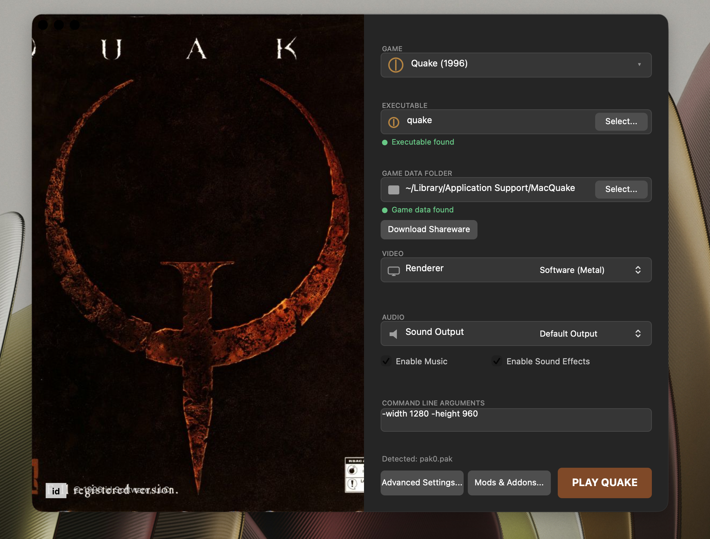
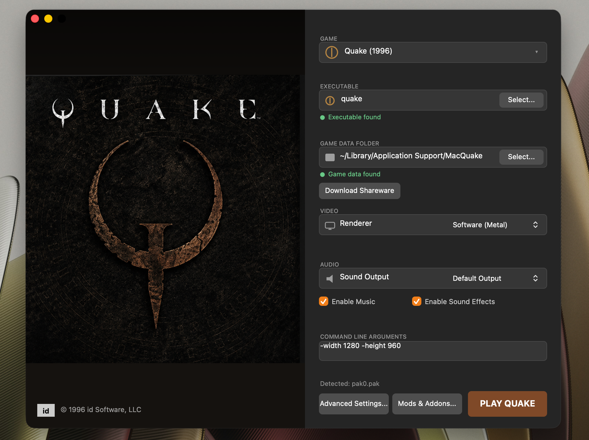

# MacQuake



<a href="https://buymeacoffee.com/plexydesk/e/540523" target="_blank"></a>

### macOS says the app is damaged?

This happens because MacQuake is not code signed or notarized. macOS Gatekeeper quarantines files downloaded from the web and shows a misleading "damaged" dialog.

To fix it, open Terminal and run:

```bash
# Remove quarantine from the DMG
xattr -d com.apple.quarantine ~/Downloads/MacQuake.dmg

# Mount and copy the app
open ~/Downloads/MacQuake.dmg
cp -R /Volumes/MacQuake/MacQuake.app /Applications/

# Remove quarantine from the app
xattr -d com.apple.quarantine /Applications/MacQuake.app

# Launch
open /Applications/MacQuake.app
```

If the first command fails, use this broader fix:

```bash
xattr -cr /Applications/MacQuake.app
```

A modern native port of id Software's classic 1996 shooter Quake, built from the ground up for Apple Silicon Macs.

No SDL. No emulation layers. No x86 assembly hacks. Just clean C and Objective C, a software renderer with a Metal framebuffer blitter, and a polished Cocoa launcher that handles everything from game data setup to one click play.

## Download

Prebuilt app bundles with shareware game data included are available through Buy Me a Coffee:

**[Get MacQuake on Buy Me a Coffee](https://buymeacoffee.com/plexydesk/e/540523)**

Your support helps cover development time and future improvements.

## Screenshot



## Features

* Native Apple Silicon build (ARM64)
* Software renderer with Metal palette lookup framebuffer display
* Polished Cocoa launcher with dark themed UI and cover art
* Automatic shareware game data installation on first launch
* One click download of shareware data from within the launcher
* Support for selecting existing Quake game data folders
* Relative mouse lock for smooth FPS gameplay
* Resizable game window with transparent title bar
* Full audio support (sound effects and music)
* Config persistence
* Clean execv handoff from launcher to game engine
* Redistributable DMG generation via Makefile

## Building from Source

Requirements:
* macOS with Xcode Command Line Tools
* Apple Silicon Mac (ARM64)

```bash
cd Quake/WinQuake
make -f Makefile.macos app
```

This builds the `MacQuake.app` bundle inside `build_macos/`. The Makefile also supports:

```bash
make -f Makefile.macos all      # Build engine + launcher binaries
make -f Makefile.macos dmg      # Build redistributable DMG
make -f Makefile.macos clean    # Clean build artifacts
```

## Game Data

MacQuake can run with the shareware `pak0.pak` or the full registered version's `pak0.pak` and `pak1.pak`.

When you launch the app:
1. If shareware data is bundled, it auto copies to `~/Library/Application Support/MacQuake/id1/`
2. If no data is found, use the launcher to download shareware or select an existing data folder

## Technical Notes

### 64 Bit QuakeC String Fix

This port fixes a critical 64 bit pointer truncation bug that causes level load crashes in most naive Quake ports. The original code stored `ptrdiff_t` pointer arithmetic results into `string_t` (32 bit int), which truncated and produced garbage offsets. The fix uses `PR_SetString()` to copy strings into the hunk, ensuring valid 32 bit offsets.

### Renderer Architecture

The engine uses the original 8 bit software renderer for all drawing. A lightweight Metal blitter performs palette lookup and upscaling to display the framebuffer. This gives authentic software rendered visuals with native Metal performance.

## License

MacQuake is based on the original Quake source code released by id Software under the GNU General Public License v2.0. See `gnu.txt` for the full license text.

The additional macOS specific code (launcher, video driver, audio driver, Metal renderer) is released under the same GPLv2 license.
